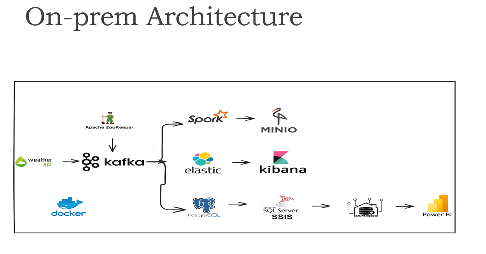

# Real-Time IoT Weather Data

This project demonstrates the architecture for real-time IoT weather data collection, processing, storage, and visualization using various open-source tools and technologies. The data pipeline handles incoming weather data through Kafka, processes it using Spark, and visualizes the insights using Power BI and Kibana.

## Table of Contents
- [Project Overview](#project-overview)
- [Architecture](#architecture)
- [Technologies Used](#technologies-used)
- [Installation](#installation)
- [How it Works](#how-it-works)
- [Visualization](#visualization)

## Project Overview
The **Real-Time IoT Weather Data** project provides a scalable and efficient system for ingesting, processing, and analyzing real-time weather data from IoT devices. The system leverages Kafka for message streaming, Spark for data processing, and a combination of SQL Server SSIS, PostgreSQL, ElasticSearch, and MinIO for data storage. Finally, the processed data is visualized in Kibana and Power BI.

## Architecture
The architecture follows a microservices-oriented approach and is designed to be scalable, leveraging various technologies for different stages of the data pipeline:

- **Weather API & IoT Devices**: Data ingestion from external weather APIs and IoT devices.
- **Kafka & Apache ZooKeeper**: Kafka acts as a message broker to handle real-time streaming data from IoT weather devices or APIs, with Apache ZooKeeper managing Kafka brokers.
- **Spark**: Processes real-time streams of weather data and writes results to storage systems.
- **MinIO**: Provides object storage for raw and processed data.
- **ElasticSearch & Kibana**: Stores and indexes data for real-time analysis and visualizes data trends.
- **PostgreSQL & SQL Server SSIS**: Stores structured data, with SSIS handling ETL tasks.
- **Data Warehouse & Power BI**: Provides advanced data analytics and visualization of the processed weather data.


## Technologies Used
- **Apache Kafka**: Real-time data streaming platform.
- **Apache ZooKeeper**: Manages Kafka brokers.
- **Apache Spark**: Distributed data processing engine.
- **ElasticSearch**: Search and analytics engine for indexing data.
- **Kibana**: Visualization tool for ElasticSearch data.
- **PostgreSQL**: Relational database for data storage.
- **Microsoft SQL Server SSIS**: ETL tool for data transformation and integration.
- **MinIO**: S3-compatible object storage.
- **Docker**: Containerization platform for deploying the services.
- **Power BI**: Data visualization and business intelligence tool.

## Installation
### Prerequisites
Ensure you have the following installed on your system:
- Docker and Docker Compose
- Kafka
- Spark
- PostgreSQL
- ElasticSearch and Kibana
- Power BI Desktop (for data visualization)

### Required Files
The PostgreSQL database and SSIS project files are provided in the following Google Drive folder:
- [Download PostgreSQL DB and SSIS Files](https://drive.google.com/drive/folders/1of0CdTXQxhd49zA6ZHruG3HILal-b6j0)

### Steps
1. Clone the repository to your local machine:
    ```bash
    git clone https://github.com/yourusername/real-time-iot-weather-data.git
    cd real-time-iot-weather-data
    ```
2. Download the PostgreSQL and SSIS files from the [Google Drive](https://drive.google.com/drive/folders/1of0CdTXQxhd49zA6ZHruG3HILal-b6j0) and set them up on your environment.

3. Start the services using Docker Compose:
    ```bash
    docker-compose up
    ```
4. Configure the data sources for your weather API, PostgreSQL, and MinIO as required.

5. Connect Power BI to the SQL Server Data Warehouse for real-time visualization.

## How it Works
1. **Data Ingestion**: Weather data from the API or IoT devices is pushed into Kafka.
2. **Real-Time Processing**: Spark processes the Kafka stream and sends the results to ElasticSearch, PostgreSQL, and MinIO for storage.
3. **ETL & Data Warehousing**: SQL Server SSIS manages the ETL process, transforming and loading the data into the data warehouse.
4. **Visualization**:
   - **Kibana** provides real-time monitoring and data visualization for ElasticSearch.
   - **Power BI** connects to the data warehouse to generate business intelligence dashboards.

## Visualization
- **Kibana**: Monitor real-time data trends and log analysis.
- **Power BI**: Visualize the aggregated weather data from the Data Warehouse for business insights.

